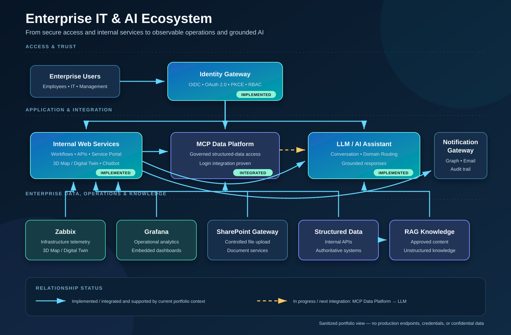

# Enterprise IT & AI Architecture

This sanitized architecture view explains how the portfolio projects form a connected enterprise platform rather than a collection of unrelated technologies.

## Relationship status

The diagram deliberately separates demonstrated connections from the next integration step:

- **Solid blue lines — implemented or integrated:** connections described by the current portfolio case studies or confirmed project context. These include centralized identity patterns, internal service APIs, SharePoint file upload, embedded Grafana dashboards, Zabbix data used for a 3D map/digital-twin view, an LLM chatbot, RAG, MCP tools for structured operational data, and Microsoft Graph-based notification delivery.
- **Dashed amber line — in progress / next integration:** direct use of the MCP Data Platform by the LLM/AI experience. Login integration with the platform has been proven; the LLM connection is the stated next step.

The status describes portfolio evidence, not a claim that every component or connection is deployed at the same production scope.

## How the components work together

| Area | Role in the ecosystem | Demonstrated relationship |
|---|---|---|
| Identity Gateway | Central authentication and token validation using OIDC, OAuth 2.0, PKCE, RS256, and JWKS patterns | Provides reusable identity boundaries for internal applications; login integration with the MCP Data Platform has been proven |
| Internal Web Services | Employee workflows, service APIs, dashboards, the 3D operational view, and chatbot entry points | Integrates with SharePoint for file upload, embeds Grafana, consumes Zabbix data, and provides internal APIs |
| Notification Gateway | Central policy and audit boundary for application email | Internal applications call an authenticated API that delivers through Microsoft Graph |
| Zabbix & Grafana | Operational telemetry and visualization | Zabbix data supports the 3D map/digital-twin view; Grafana dashboards are embedded into internal services |
| SharePoint Gateway | Controlled document and file integration | Internal Web Services can upload files without exposing implementation credentials in the portfolio |
| MCP Data Platform & Structured Data | Governed access to authoritative operational information | Uses owned service contracts and MCP-style boundaries instead of unrestricted direct database access |
| LLM / AI & RAG | Natural-language interaction over approved knowledge and operational data | RAG handles approved knowledge; MCP tools and internal APIs handle structured facts with deterministic formatting |

## Recruiter / hiring-manager perspective

The architecture demonstrates end-to-end platform thinking across identity, application delivery, API integration, observability, enterprise data, notifications, and grounded AI. Its value is in the relationships: operational systems remain authoritative, gateways create reusable control points, and AI consumes approved knowledge and structured data through explicit boundaries.

## Evidence in this repository

- [Identity & SSO Platform](../../projects/identity-sso-platform.md)
- [IT Services Internal Digital Platform](../../projects/it-services-platform.md)
- [Meeting Room Booking & Operational Analytics](../../projects/meeting-room-analytics.md)
- [Notification Gateway Platform](../../projects/notification-gateway.md)
- [Sally Internal AI](../../projects/internal-ai-platform.md)

> **Confidentiality note:** This diagram intentionally omits production hostnames, addresses, tenant details, credentials, sensitive records, and proprietary implementation details.
